## Setup Dataverse Infrastructure on Amazon Elastic Container Service for Kubernetes (EKS) and on Microsoft Azure Kubernetes Services (AKS)

In this topic, we create Dataverse infrastructure on Amazon EKS cluster and on on [Microsoft AKS](#AKS).<br/>
We registered dataverse.tk domain name. Register at [freenom](https://freenom.com) and search for our preferred domain then buy it for free.<br/>
With [freenom](https://freenom.com) we can plenty of free domains such as .tk , .cf , .ml , .ga, .gq without the need of any credit card or financial information.
   
### Prerequisites
Before setting up the Dataverse kubernetes cluster, we’ll need an [AWS account](https://aws.amazon.com/account/).
### Installing AWS CLI
First we need an installation of the [AWS Command Line Interface](https://aws.amazon.com/cli/).<br/>
AWS CLI requires Python 2.6.5 or higher. Installation using pip.

        pip install awscli

Make sure to configure the AWS CLI to use our access key ID and secret access key:
        
        aws configure

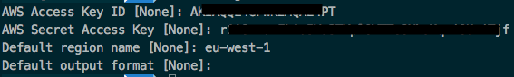


The instruction to get access key ID an secret access key can be found on [AWS - Managing Access Keys for IAM Users - Managing Access Keys (Console)
](https://docs.aws.amazon.com/IAM/latest/UserGuide/id_credentials_access-keys.html?icmpid=docs_iam_console#Using_CreateAccessKey).

### Installing Kubernetes Operations(KOPS) and Kubectl
On Mac OS X, we’ll use brew to install. 

        brew update && brew install kops kubectl

Check the kops an kubectl version:

        kops version

Version 1.13.0

        kubectl version
        
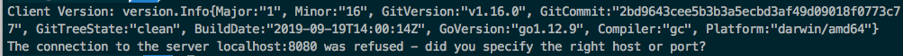

We're also going to make use of [Helm](https://helm.sh/) - a package manager for Kubernetes, that will be explained as [it come up](#install-helm).
### Setting up a Kubernetes cluster using KOPS on AWS
Choose a cluster name, e.q. dans.dataverse.tk and save as kops environment variable:

        export KOPS_CLUSTER_NAME=dans.dataverse.tk

Create a S3 bucket to store the cluster state using AWS CLI:

        aws s3api create-bucket --bucket dans-dataverse-state-store --region eu-central-1 --create-bucket-configuration LocationConstraint=eu-central-1

Now when we check our bucket, we would see:
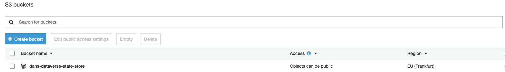

Once you’ve created the bucket, execute the following command:

        export KOPS_STATE_STORE=s3://dans-dataverse-state-store

For safe keeping we should add the two environment variables: **KOPS_CLUSTER_NAME** and **KOPS_STATE_STORE** to the ~/.bash_profile or ~/.bashrc configs or whatever the equivalent e.q _.zshrc_ .
Since we are on AWS we can use a S3 backing store. It is recommended to enabling versioning on the S3 bucket.<br/>
Let’s enable versioning to revert or recover a previous state store. 

        aws s3api put-bucket-versioning --bucket dans-dataverse-state-store  --versioning-configuration Status=Enabled

### Creating the cluster
AWS is now as ready as it can be, to generate the cluster configuration using the following command:

        kops create cluster --node-count 1 --master-size t2.medium --master-volume-size 10 --node-size t2.medium --node-volume-size 10 --zones eu-central-1a

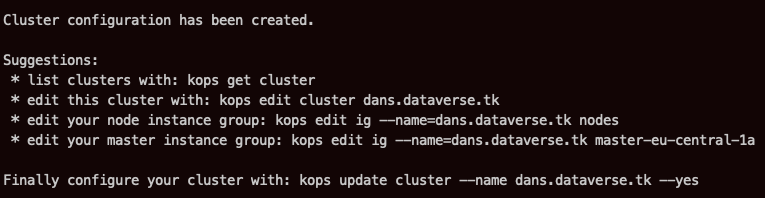

When we create cluster for the first time, we will get the following output:
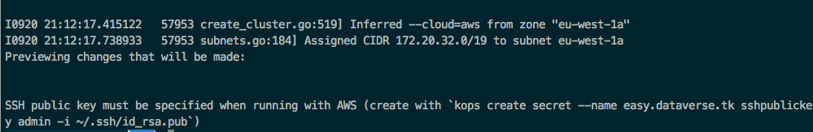

As it is shown in the figure above, execute:

        kops create secret --name ${KOPS_CLUSTER_NAME} sshpublickey admin -i ~/.ssh/id_rsa.pub
 
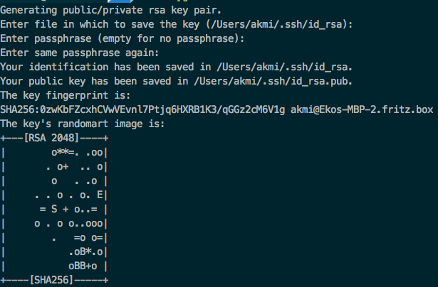
<br/>
<br/>

Initiate the cluster with an update command:

        kops update cluster --name ${KOPS_CLUSTER_NAME} --yes

This will create the resources needed for our cluster to run. It will create a master and two node instances.

Wait for the cluster to start-up (sometimes it needs about a half hour), validate the cluster to ensure the master + 2 nodes have launched:

        kops validate cluster

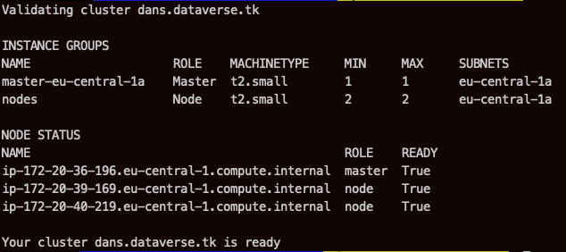

If we validate too early, we’ll get an error. 

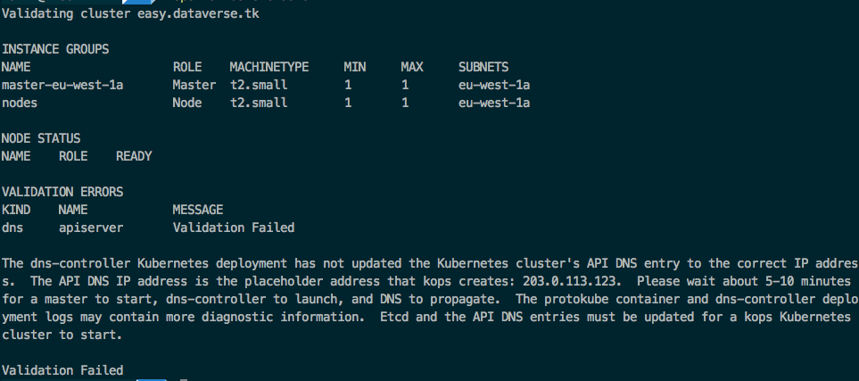

We will see on the aws web ui console:
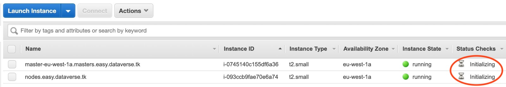

After some time, it still shows error:

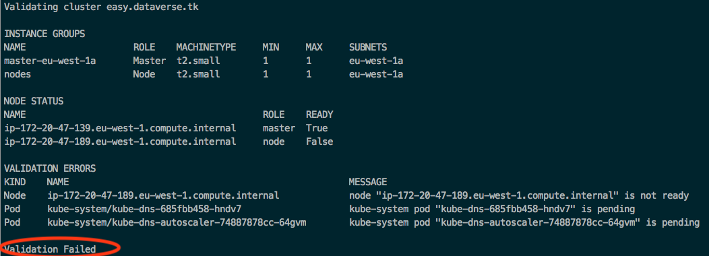

Wait a little longer for the nodes to launch, and the validate step will return without error.

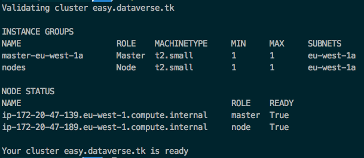

We will see on the aws web ui console:

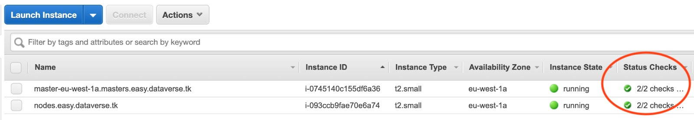


Confirm that kubectl is connected to the Kubernetes cluster.
```commandline
kubeclt get nodes
```
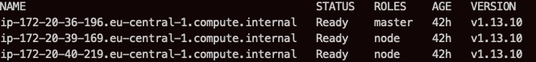

```commandline
kubeclt cluster-info
```
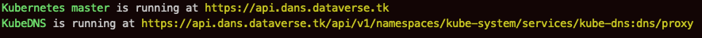


Now when we check our instances on AWS, we would see three new instances that would have got created. 
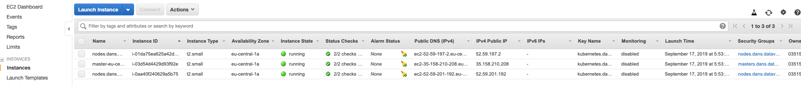

Our s3 bucket will now have some folder in it, which is basically our cluster configuration file.
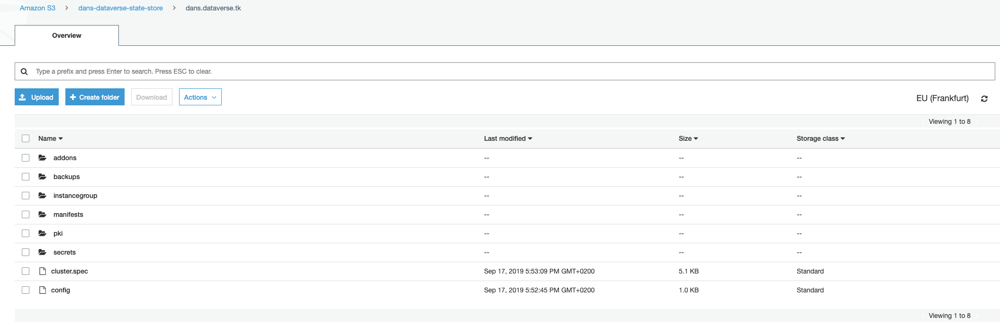


## <a name="AKS"></a>Setup Dataverse Infrastructure on Microsoft Azure Kubernetes Services (AKS)

In this topic, we create Dataverse infrastructure on Microsoft Azure Kubernetes EKS cluster.

### Prerequisites
Before setting up the Dataverse kubernetes cluster, we’ll need an [Azure CLI](https://docs.microsoft.com/en-us/cli/azure/install-azure-cli-yum?view=azure-cli-latest).
### Installing Azure CLI
First we need an installation of the [Azure Command Line Interface](Azure CLI.<br/>
On Mac OS X, we’ll use brew to install. 

        brew install azure-cli

The following environments need to setup:
        
        export LOCATION=eastus
        export RESOURCE_GROUP=easy-dataverse-poc
        export CLUSTER_NAME=easy-dataverse-cluster

The location where the cluster will be installed can be listed by using the following command:

        az account list-locations
        
        
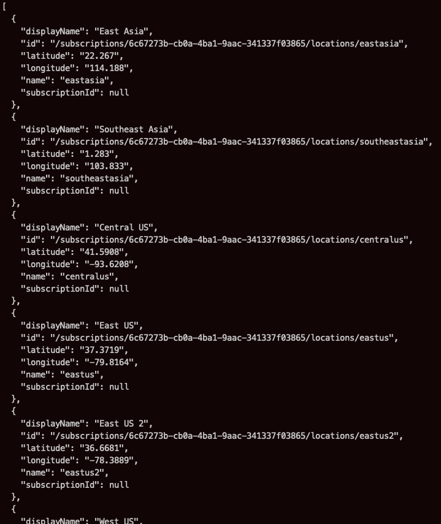


Make sure to configure the Azure CLI to use our access key ID and secret access key.
        
        az aks get-credentials --resource-group $RESOURCE_GROUP --name $CLUSTER_NAME --admin
        
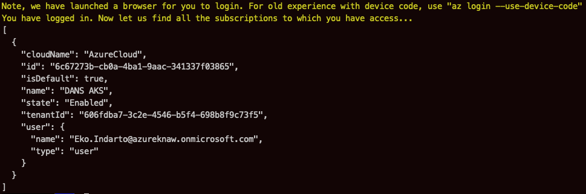

The following screen will be shown in the default browser:

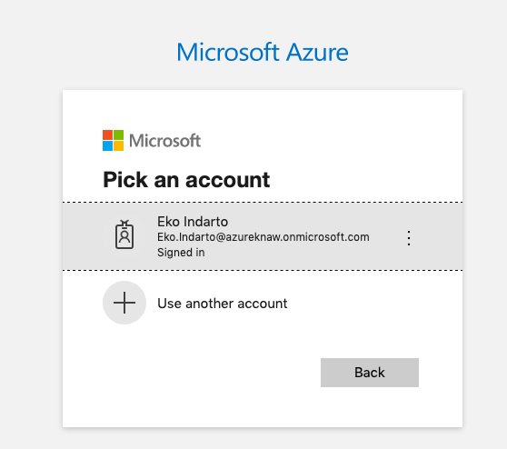

After fill in the correct password, the following screen will be shown:

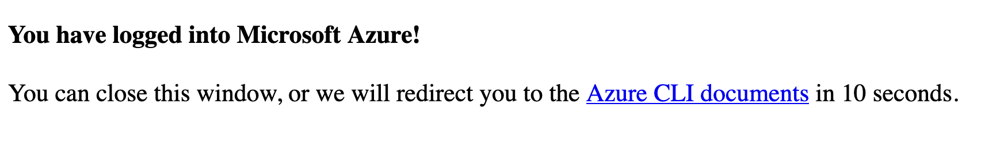

Check the az account: 
        
            az account show
            
            
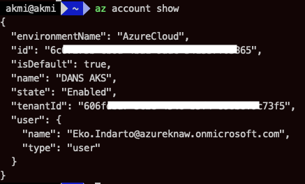


### Creating cluster

Check the kubernetes supported version for the given location:

        az aks get-versions --location eastus --output table


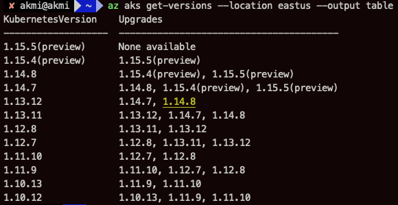


### Setting up a Kubernetes cluster using Azure CLI
Create azure cluster by using the following command:

         az aks create --resource-group $RESOURCE_GROUP --name $CLUSTER_NAME --generate-ssh-keys  --kubernetes-version 1.15.3  --enable-rbac --node-vm-size Standard_DS3_v2


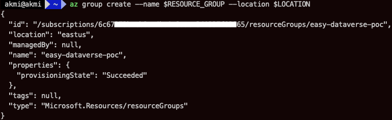


Now when we check our cluster on the portal.azure.com, we would see:
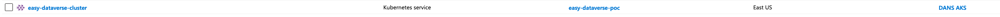


### Deploying Dataverse, ddi-converter-tool and filepreviewers to cluster
Clone this project:

        git clone https://github.com/ekoi/dataverse-kubernetes.git
        git checkout -b ddi-converter-tool 

Deploy dataverse:
        
        kubectl apply -k docs/aws-demo

Check the deployed services:

        kubectl get services
        
Output:

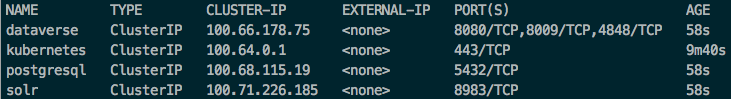

Check the deployed pods:

        kubectl get pods:
        
Output:

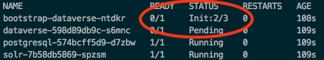        

As we can seen, it displays _pending_ status.      
Please wait a little bit until Dataverse is running properly. Confirm it by executing the following command:
        
        kubectl get pods
We will see READY 1/1 and Status Running for dataverse, solr and postgres pods:
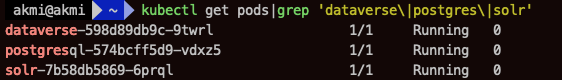

Use the port-forward to see whether the dataverse running properly:
        
        kubectl port-forward service/dataverse 8080:8080
        
Open a browser, go to : http://localhost:8080

When everything goes fine, to the steps (deploying fileviewers, ddi-converter etc). 
When the status of Dataverse shows _pending_ after a while (let says after half an hour), it can be indication of Dataverse starting problem.
Check the Dataverse log file:
        
        kubectl log dataverse-xxx-xxx # use here the right dataverse pod by executing kubectl get pods        

Install [Kuberbetes Dashboard](#dashboard).
The following screenshot from kubernetes Dashboard shows an example of problem during starting the Dataverse.

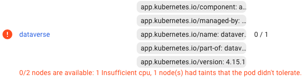

Deploy fileviewers:
    
        kubectl apply -k k8s/filepreviewers
        
Deploy ddi-converter-tool:
    
        kubectl apply -k k8s/ddi-converter-tool
        
### Expose Kubernetes services on dataverse.tk
Some of the following steps will be done manually on AWS Route 53. 

On AWS Route 53, create hosted zone with domain name: dataverse.tk

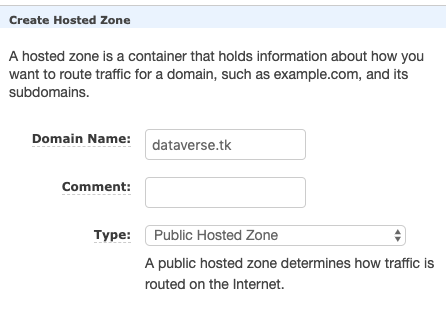

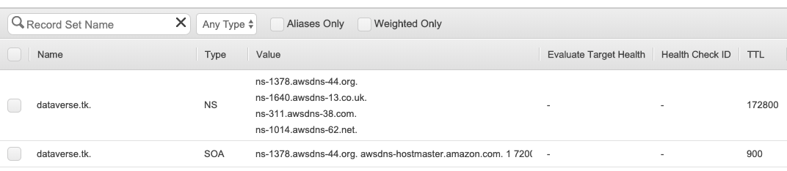

On Freenom, by clicking management tools - Use custom nameservers (enter below), change the DNS to Route 53. 

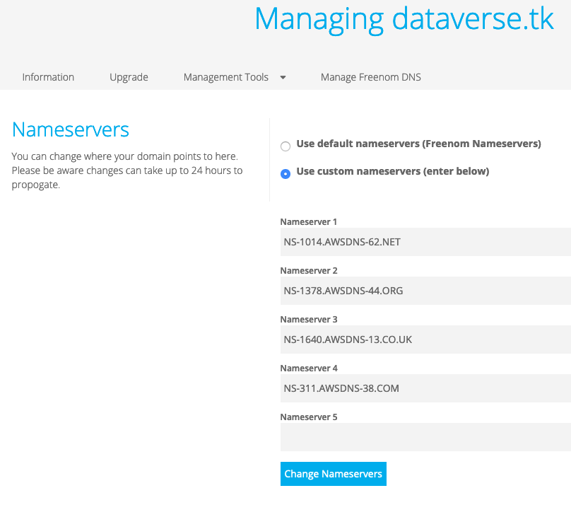

Before continue to the next step, please edit the k8s/nginx/ingress.yaml file. Edit the _host_ with right (sub)domain name.
Deploy nginx:
    
        kubectl apply -k k8s/nginx

Confirm that the service has external ip.
        
        kubectl get svc --namespace=ingress-nginx
 
 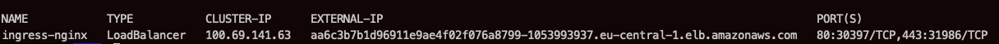       
 
 Go to Route 53 and create dans.dataverse.tk, fileviewers.dataverse.tk and dct.dataverse.tk records with type CNAME 
 and the value is the external ip of ingress-nginx service.
 
 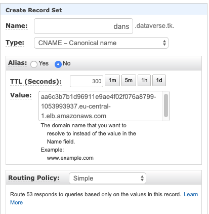 
 
 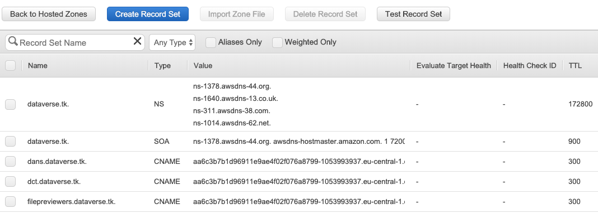 
 
Now, the http://dans.dataverse.tk should be accessible from the browser.
     
### Setting certification manager to automated Let’s Encrypt ssl certification
 <a name="installing-helm">Installing _helm_ using brew</a>:
        
        brew install kubernetes-helm
        
Since Tiller Pod needs to run as a privileged service account, with cluter-admin ClusterRole, initialized helm with a service account, otherwise we will get "Error: release cert-manager failed: namespaces "kube-system" is forbidden".
        
         kubectl apply -f k8s/letscrypt/rbac-config.yaml
         helm init --service-account tiller
         helm repo update

Execute _helm ls_, there would not be any output from running this command and that is expected. 
         
         helm ls
                 
Install tiller service account:
        
        kubectl create serviceaccount tiller --namespace=kube-system
        kubectl create clusterrolebinding tiller-admin --serviceaccount=kube-system:tiller --clusterrole=cluster-admin
        kubectl apply -f k8s/letscrypt/00-crds.yaml
Output:
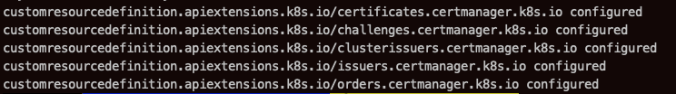 

Install certificate manager in kubernetes:
        
        kubectl label namespace default certmanager.k8s.io/disable-validation="true"
        helm repo add jetstack https://charts.jetstack.io
        helm repo update
        helm install --name cert-manager --namespace default jetstack/cert-manager
We can see what this process looks like:
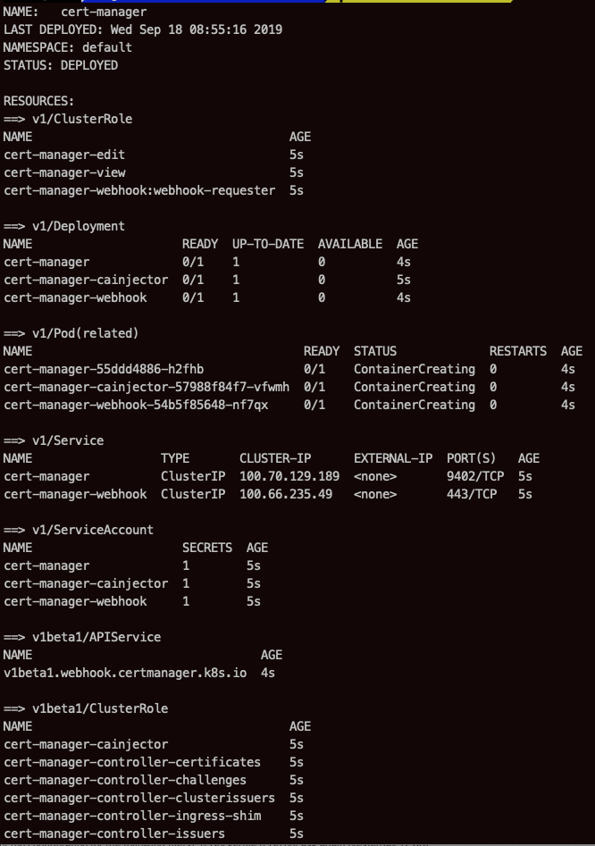
    
Deploy certification issuer:

        kubectl create -f k8s/letscrypt/issure.yaml
        
Output:

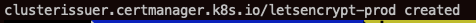

Confirm the status of certificate:
    
        kubectl get certificate
        kubectl describe certificate
        
Output:
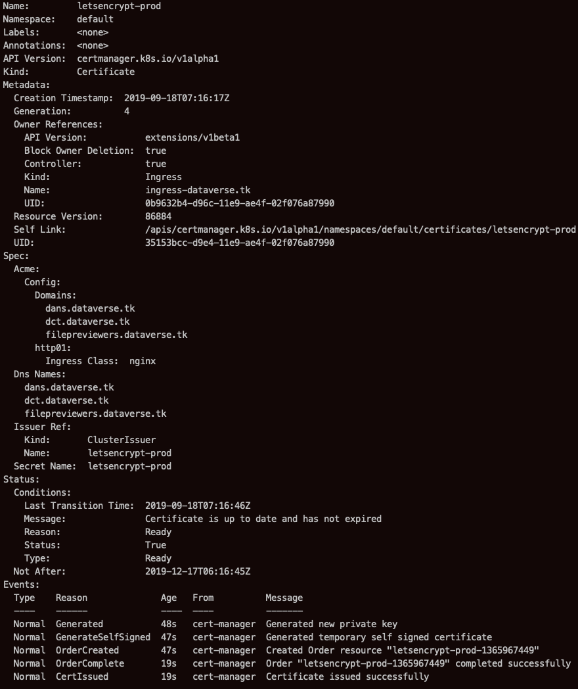

After waiting a bit, let's check it:
        
        helm list

Output:
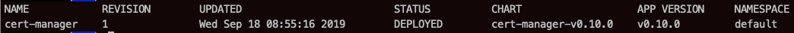

Deploy ingress-nginx:
        
        kubectl apply -f k8s/letscrypt/ingress.yaml
        
Wait a little bit, and then confirm it using _curl_:
    
        curl --insecure -v https://dans.dataverse.tk 2>&1 | awk 'BEGIN { cert=0 } /^\* SSL connection/ { cert=1 } /^\*/ { if (cert) print }'
        
We can see:
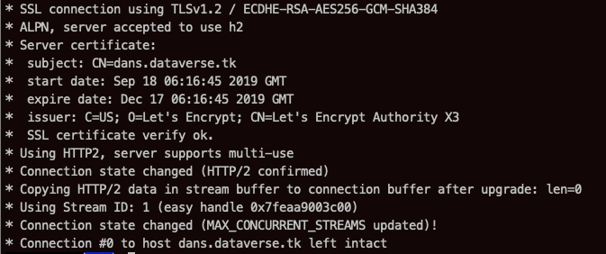

                
###  <a name="dashboard"></a>Kubernetes Dashboard
The following steps are about installing the kubernetes dashboard version v1.1, not the latest version.
    
        kubectl apply -f k8s/dashboard/kubernetes-dashboard.yaml
        kubectl apply -f k8s/dashboard/heapster.yaml
        kubectl apply -f k8s/dashboard/influxdb.yaml
        kubectl apply -f k8s/dashboard/heapster-rbac.yaml
        kubectl apply -f k8s/dashboard/eks-admin-service-account.yaml
        
Retrieve the authentication token, using the following command:   
        
        kubectl -n kube-system describe secret $(kubectl -n kube-system get secret | grep eks-admin | awk '{print $1}')
        
We need to copy the token to the clipboard.
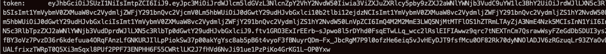

We access Dashboard using the following command:

        kubectl proxy

Output:

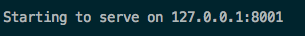


The Dashboard will available at:
        
        http://localhost:8001/api/v1/namespaces/kubernetes-dashboard/services/https:kubernetes-dashboard:/proxy/#!/login (http://localhost:8001/api/v1/namespaces/kubernetes-dashboard/services/https:kubernetes-dashboard:/proxy/#!/login


Choose the Token option, and then paste the token from the clipboard, and click the Sign In button.
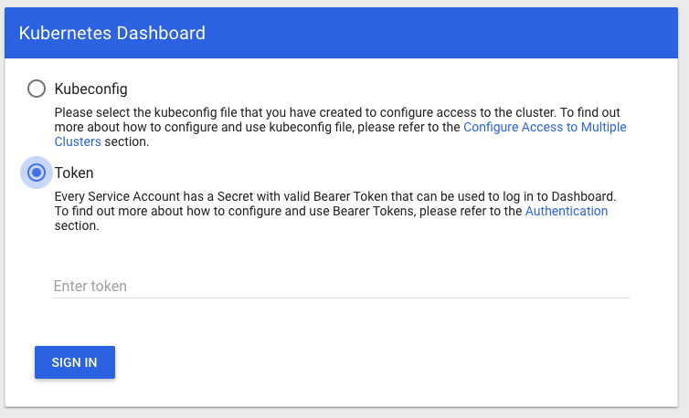
        
### Setting Up Jenkins                

### Delete the Kubernetes Cluster
If at any point we want to destroy our cluster or if we messed up and need to start over.
Execute the following command:
    
        kops delete cluster --name ${KOPS_CLUSTER_NAME} --yes


