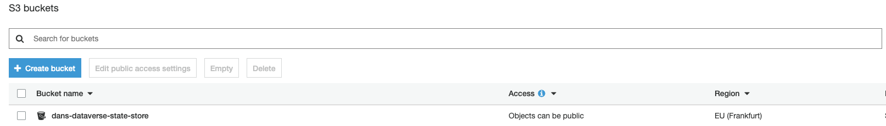
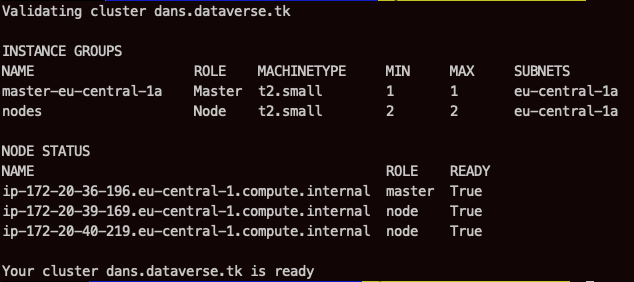
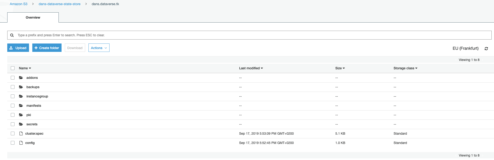
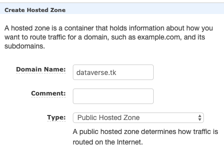
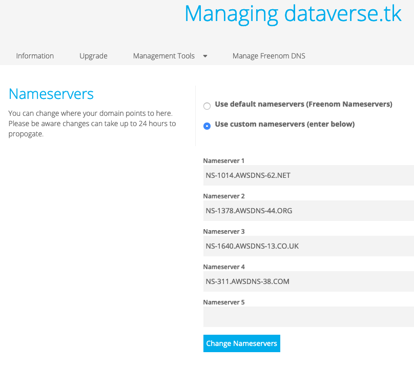
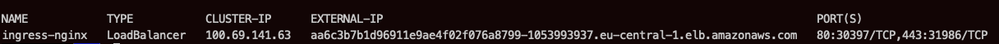

## Setup Dataverse Infrastructure on Amazon Elastic Container Service for Kubernetes (EKS)

In this topic, we create Dataverse infrastructure on Amazon EKS cluster.
We registered dataverse.tk domain name. Register at [freenom](https://freenom.com) and search for your preferred domain then buy it for free.<br/>
With [freenom](https://freenom.com) we can plenty of free domains such as .tk , .cf , .ml , .ga, .gq without the need of any credit card or financial information.
   
### Prerequisites
Before setting up the Dataverse kubernetes cluster, we’ll need an [AWS account](https://aws.amazon.com/account/).
### Installing AWS CLI
First we need an installation of the [AWS Command Line Interface](https://aws.amazon.com/cli/).<br/>
AWS CLI requires Python 2.6.5 or higher. Installation using pip.
```commandline
$pip install awscli
```

Make sure to configure the AWS CLI to use your access key ID and secret access key:
````
$aws configure
AWS Access Key ID [****************E4PT]:
AWS Secret Access Key [****************iTjf]:
Default region name [eu-central-1]:
Default output format [None]:
````
The instruction to get access key ID an secret access key can be found on [AWS - Managing Access Keys for IAM Users - Managing Access Keys (Console)
](https://docs.aws.amazon.com/IAM/latest/UserGuide/id_credentials_access-keys.html?icmpid=docs_iam_console#Using_CreateAccessKey).
The region 
### Installing Kubernetes Operations(KOPS) and Kubectl
On Mac OS X, we’ll use brew to install. 
```commandline
$brew update && brew install kops kubectl
```
Check the kops an kubectl version:
```commandline
$kops version
Version 1.13.0
$kubectl version
 Client Version: version.Info{Major:"1", Minor:"15", GitVersion:"v1.15.3", GitCommit:"2d3c76f9091b6bec110a5e63777c332469e0cba2", GitTreeState:"clean", BuildDate:"2019-08-19T12:36:28Z", GoVersion:"go1.12.9", Compiler:"gc", Platform:"darwin/amd64"}
 Server Version: version.Info{Major:"1", Minor:"13", GitVersion:"v1.13.10", GitCommit:"37d169313237cb4ceb2cc4bef300f2ae3053c1a2", GitTreeState:"clean", BuildDate:"2019-08-19T10:44:49Z", GoVersion:"go1.11.13", Compiler:"gc", Platform:"linux/amd64"}
```
We're also going to make use of a other tool, namely [Helm](https://helm.sh/), that will be explained as it come up.
### Setting up a Kubernetes cluster using KOPS on AWS
Choose a cluster name, e.q. dans.dataverse.tk and save as kops environment variable:
```commandline
export KOPS_CLUSTER_NAME=dans.dataverse.tk
```
Create a S3 bucket to store the cluster state using AWS CLI:
```commandline
aws s3api create-bucket --bucket dans-dataverse-state-store --region eu-central-1 --create-bucket-configuration LocationConstraint=eu-central-1
```
Now when we check our bucket, we would see:


Once you’ve created the bucket, execute the following command:
```commandline
export KOPS_STATE_STORE=s3://dans-dataverse-state-store
```
For safe keeping we should add the two environment variables: **KOPS_CLUSTER_NAME** and **KOPS_STATE_STORE** to the ~/.bash_profile or ~/.bashrc configs or whatever the equivalent e.q _.zshrc_ .
Since we are on AWS we can use a S3 backing store. It is recommended to enabling versioning on the S3 bucket.<br/>
Let’s enable versioning to revert or recover a previous state store. 
```commandline
aws s3api put-bucket-versioning --bucket dans-dataverse-state-store  --versioning-configuration Status=Enabled
```
### Creating the cluster
AWS is now as ready as it can be, to generate the cluster configuration using the following command:
```commandline
kops create cluster --node-count 1 --master-size t2.small --master-volume-size 10 --node-size t2.small --node-volume-size 10 --zones eu-central-1a
```


Initiate the cluster with an update command:
```commandline
kops update cluster --name ${KOPS_CLUSTER_NAME} --yes
```
This will create the resources needed for your cluster to run. It will create a master and two node instances.

Wait for the cluster to start-up (sometimes it needs about a half hour), validate the cluster to ensure the master + 2 nodes have launched:
```commandline
kops validate cluster
```


If we validate too early, we’ll get an error. Wait a little longer for the nodes to launch, and the validate step will return without error.

Confirm that kubectl is connected to your Kubernetes cluster.
```commandline
kubeclt get nodes
```


```commandline
kubeclt cluster-info
```


Now when we check our instances on AWS, we would see three new instances that would have got created. 


Our s3 bucket will now have some folder in it, which is basically our cluster configuration file.


### Deploying Dataverse, ddi-converter-tool and filepreviewers to cluster
Clone this project:

        git clone https://github.com/ekoi/dataverse-kubernetes.git
        git checkout -b ddi-converter-tool 

Deploy dataverse:
        
        kubectl apply -k docs/aws-demo
        
Deploy fileviewers:
    
        kubectl apply -k k8s/filepreviewers
        
Deploy ddi-converter-tool:
    
        kubectl apply -k k8s/ddi-converter-tool
        
### Expose Kubernetes services on dataverse.tk
Some of the following steps will be done manually on AWS Route 53. 

On AWS Route 53, create hosted zone with domain name: dataverse.tk




On Freenom, by clicking management tools - Use custom nameservers (enter below), change the DNS to Route 53. 



Deploy nginx:
    
        kubectl apply -k k8s/nginx

Confirm that the service has external ip.
        
        kubectl get svc --namespace=ingress-nginx
 
        
 
 Go to Route 53 and create dans.dataverse.tk, fileviewers.dataverse.tk and dct.dataverse.tk records with type CNAME 
 and the value is the external ip of ingress-nginx service.
 
  
 
  
 
Now, the http://dans.dataverse.tk should be accessible from the browser.
     
### Automate Let’s Encrypt ssl certification
Installing _helm_ using brew:
        
        brew install kubernetes-helm


### Kubernetes Dashboard

### Setting Up Jenkins                